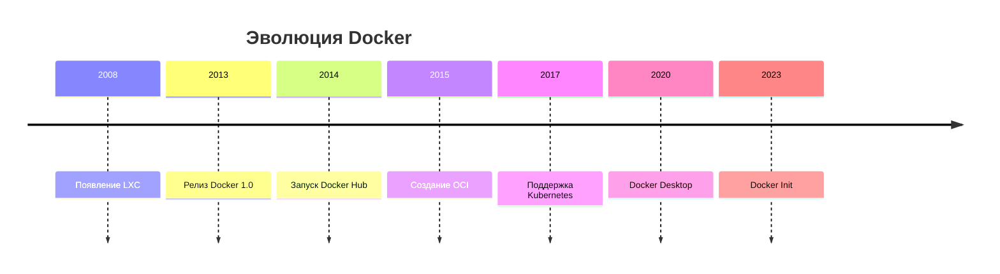

# 🐳 DockerInfo

<div align="center">
  
  
  ### 📚 Истории о Docker
  
  [](https://www.docker.com/)
  [](https://www.linux.org/)
  [](https://www.markdownguide.org/)
</div>

---

## 📋 Содержание

- История Docker
- Основные этапы развития
- Docker Hub
- Экосистема Docker
- Интересные факты о Docker
---

## 🐋 История Docker

### **Истоки (2008-2013)**

История Docker начинается с технологии контейнеризации Linux, в частности с **LXC (Linux Containers)**, которая появилась в 2008 году. Однако настоящая революция произошла в 2013 году, когда компания **dotCloud** (позже переименованная в Docker Inc.) представила миру Docker.


#
# 🐋Кто создал Docker?
Основателем Docker считается Соломон Хайкс (Solomon Hykes), который вместе с тремя коллегами основал компанию dotCloud в 2010 году. Изначально это была платформа как услуга (PaaS), но внутренний инструмент для контейнеризации оказался настолько удачным, что компания решила сделать его основным продуктом.
    
    "Docker был рожден из необходимости решить проблему, с которой мы сталкивались каждый день: как заставить приложения работать одинаково на всех этапах разработки и в production." — Соломон Хайкс
#
# 📈 Основные этапы развития
2013: Рождение Docker
- Март 2013 — Презентация Docker на PyCon

- Август 2013 — Первый публичный релиз

- Более 100 000 загрузок за первый месяц

2014: Рост популярности
- Июнь 2014 — Релиз Docker 1.0

- Июль 2014 — Запуск Docker Hub

- Крупные компании начинают использовать Docker

2015: Индустриальный стандарт
- Создание Open Container Initiative (OCI)

- Docker становится стандартом де-факто

- Более 100 млн загрузок

2016-2017: Оркестрация
- Интеграция с Kubernetes

- Docker Swarm Mode

- Появление Docker Compose

2018-2020: Энтерпрайз
Docker Enterprise Edition

- Миграция на Moby Project

- Docker Desktop для Windows и Mac

2021-настоящее время
- Docker Init для упрощения создания проектов

- Интеграция с GitHub Actions

- Расширение экосистемы
#
# ☁️ Docker Hub
## Docker Hub — это крупнейший в мире реестр контейнерных образов и сообщество разработчиков.
### Ключевые особенности:
|Функция|Описание|
|-|-|
|📦 Публичные репозитории|Бесплатное хранение публичных образов|
|🔒 Приватные репозитории|Платные приватные репозитории|
|🤖 Автоматическая сборка|Интеграция с GitHub/Bitbucket|
|⚡ Официальные образы|Проверенные образы от ведущих компаний|
|🔍 Поиск образов|Тысячи готовых к использованию образов|
### Статистика Docker Hub:
🌍 Более 10 миллионов разработчиков

📦 Более 8 миллионов репозиториев

📥 Более 13 миллиардов скачиваний образов

🏢 Более 60 000 организаций
### Самые скачиваемые образы
- ubuntu
- nginx
- alpine
- node
- python
- mysql
- postgres
- redis

|DOCKER ECOSYSTEM||
|-|-|
|Docker|Docker|
|Client|Daemon|
|Docker|Docker|
|Compose|Swarm|
|Docker|Docker|
|Hub|Registry|
#
# 🔧Инструменты Docker:
|Инструмент|	Назначение|
|-|-|
|🖥️ Docker Engine|	Основной движок для запуска контейнеров|
|📦 Docker Compose|	Оркестрация многоконтейнерных приложений|
|🌐 Docker Swarm|	Кластеризация и оркестрация|
|📦 Docker Registry|	Хранение образов|
|🔧 Docker Machine	|Управление Docker хостами|
|📝 Dockerfile|	Описание сборки образа|
## 🎯 Интересные факты из истории Docker

### **Почему "Docker"?**

Название "Docker" появилось не случайно. Компания dotCloud использовала внутреннюю систему контейнеризации, которую сравнили с работой докеров (dock workers) в порту:

> *"Как докеры загружают контейнеры на корабли стандартизированным способом, так и наша технология позволяет упаковывать и перемещать приложения одинаково эффективно"* — Соломон Хайкс

### **Логотип Docker - Moby Dock**

<div align="center">
  
</div>

Знаменитый кит с контейнерами на спине появился в 2013 году. Его назвали **Moby Dock** (игра слов: Moby Dick + Docker). Интересные факты о логотипе:
- Кит символизирует мощь и масштабируемость
- Контейнеры на спине - переносимость приложений
- Синий цвет выбран за его ассоциацию с океаном и технологичностью
- В 2017 году появился проект **Moby** - открытая платформа для сборки контейнерных систем

### **Docker и война контейнеров**

В 2014-2015 годах развернулась настоящая "война контейнеров" между Docker и конкурентами:

| Год | Событие |
|-----|---------|
| 2014 | **CoreOS** запускает Rocket (rkt) как альтернативу Docker |
| 2015 | Создание **OCI (Open Container Initiative)** под эгидой Linux Foundation |
| 2015 | Google запускает **Kubernetes** 1.0 |
| 2016 | Docker добавляет поддержку Kubernetes |
| 2017 | **CRI-O** и **containerd** становятся стандартами |
#
### **Курьезные случаи**

#### 🐛 **Баги с именами контейнеров**
Docker автоматически генерирует имена для контейнеров, если не указано другое. Самое длинное автоматическое имя было:
```bash
# Пример автоматически сгенерированного имени
docker run -d nginx
# Контейнер получил имя: "focused_morse"
```
#### Самый маленький рабочий образ
    FROM scratch
    COPY hello /
    CMD ["/hello"]
# Забавные названия версий
Docker использовал забавные кодовые имена для релизов:

|Версия|	Кодовое имя|
|-|-|
|1.8|	"Tufted Quail" (Хохлатая куропатка)|
|1.9|"Sneaky Peccary" (Хитрый пекари)|
|1.10|	"Toxic Boar" (Ядовитый кабан)|
|1.11|	"Tinkerbell" (Динь-Динь)|
|1.12|	"Raccoon" (Енот)|
|17.03|	"Ostrovsky" (в честь программиста)|