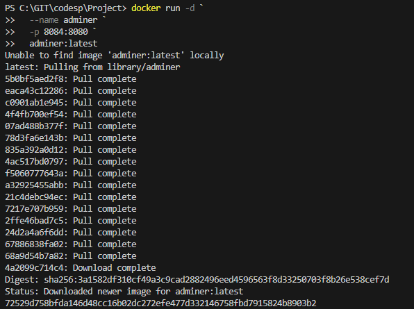
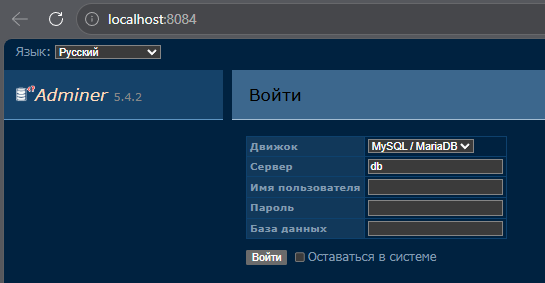

# Adminer
Adminer (альтернатива phpMyAdmin)
Запуск Adminer для управления БД
### Запустите Adminer в Windows Powershell

    docker run -d `
    --name adminer `
    -p 8084:8080 `
    adminer:latest

### Откройте: http://localhost:8084  

###  **Важно**
Без отдельно запущенного контейнера с БД PostgreSQL и связи с ним админ-панель работаеть не будет!

Заполнять данные админ-панели не нужно!