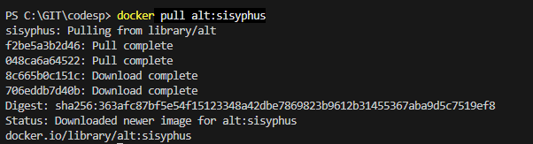
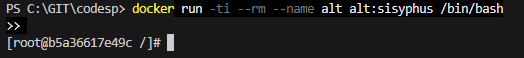
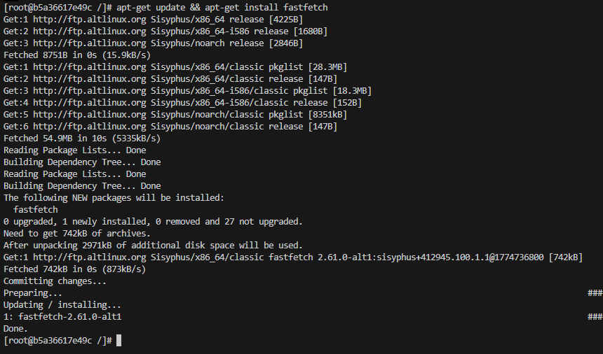
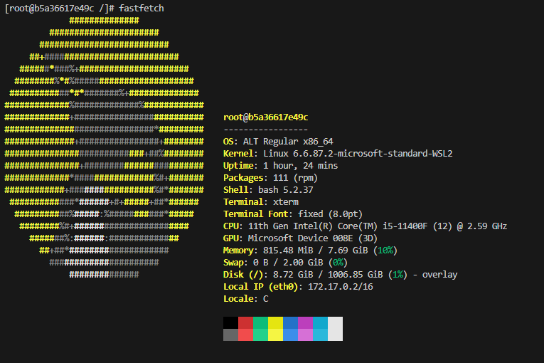
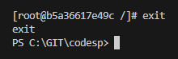

# Alt Linux в Docker
### Использовать контейнер с Alt
Загрузить готовый образ Alt

    docker pull alt:sisyphus

### Запустить и использовать

    docker run -ti --rm --name alt alt:sisyphus /bin/bash

### Установить приложение Fastfetch в контейнере

    apt-get update && apt-get install fastfetch

### Запустить Fastfetch

    fastfetch

### Выйти из контейнера с Alt

    exit
