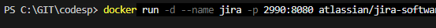
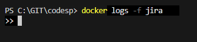

# Jira
### Платформа обратной связи и коммуникации, часть инструментария DevOps

### Загрузить образ, создать и запустить контейнер

    docker run -d --name jira -p 2990:8080 atlassian/jira-software:latest

### Запустите лог Jira для наблюдением за процессом подготовки приложения:

    docker logs -f jira

### В логах должно быть видна подготовка Jira. Образ при первом запуске долго инициализируется (до 5-10 минут).

Приложение, запущенное в контейнере может готовится долго, поэтому в браузере вы не сразу можете увидеть результат.

По завершению подготовки можно открыть в браузере запущенное приложение Jira:

Зайти в админ-панель Jira в браузере по адреcу http://localhost:2990