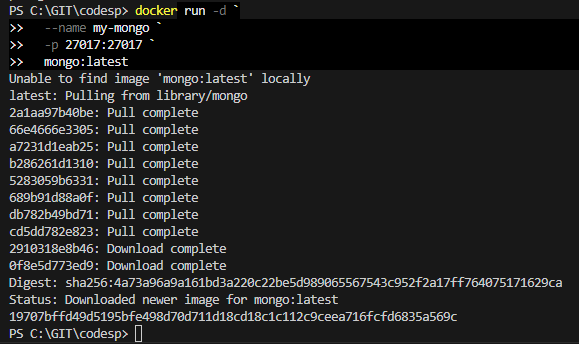
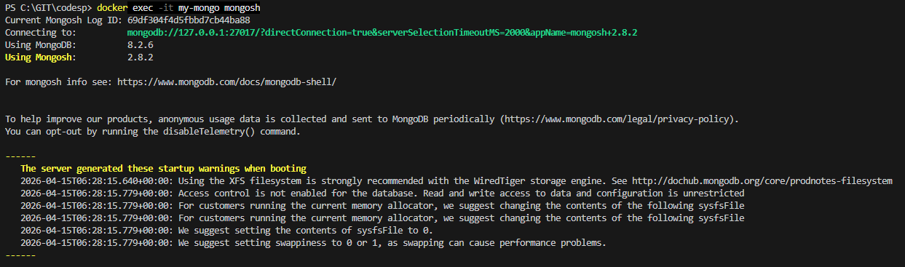
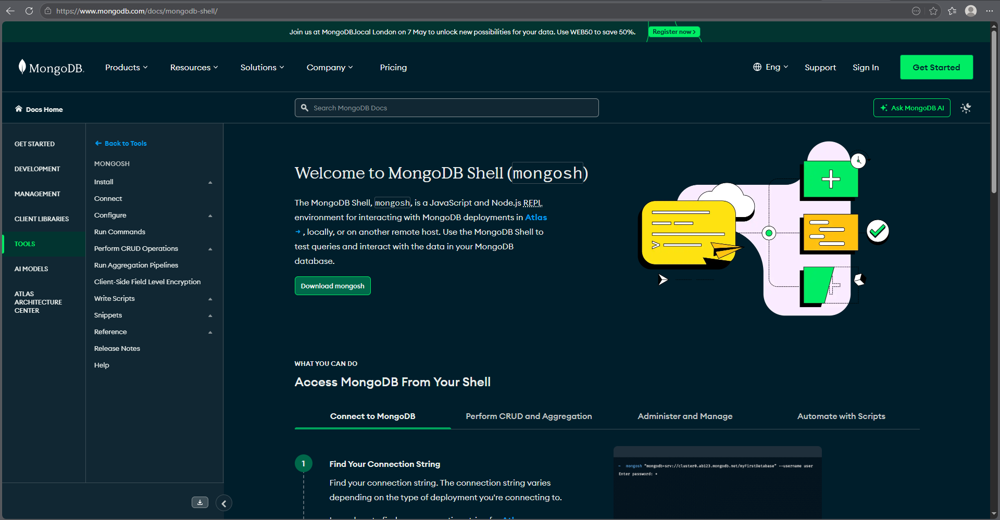

# MongoDB (NoSQL)
### Запуск MongoDB
в Windows Powershell
    
    docker run -d `
    --name my-mongo `
    -p 27017:27017 `
    mongo:latest

### Подключиться через shell

    docker exec -it my-mongo mongosh

### Страница в Браузере 
