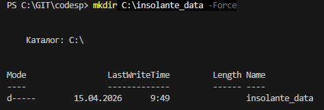
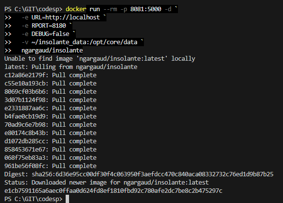
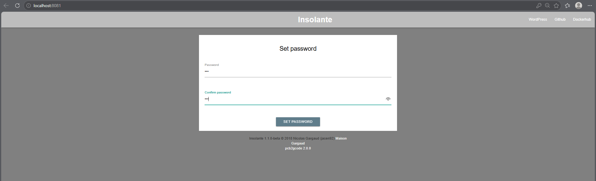
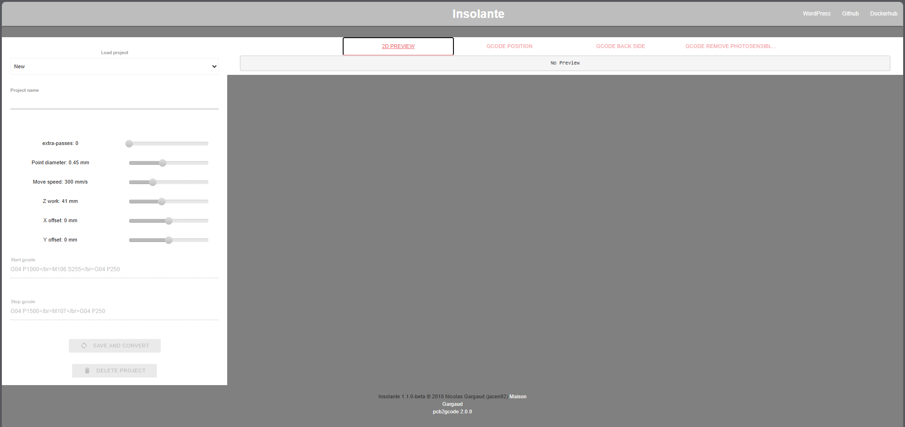

# Pcb2gcode web application wrapper
Оболочка для веб-приложения Pcb2gcode. Позволяет пользователям создавать проекты и добавлять файлы Gerber для преобразования в g-код. Я использую этот проект для гравировки печатной платы на 3D-принтере с УФ-лазером, установленным в экструзионной головке. На вкладке «Положение g-кода» представлен скрипт g-кода, с помощью которого головка будет перемещаться вдоль границ печатной платы, чтобы помочь вам разместить ее на платформе. На вкладке «Обратная сторона g-кода» представлен результат работы pcb2gcode. На вкладке «Удаление g-кода» находится скрипт g-кода, с помощью которого головка перемещается в любое место на плате для удаления остатков смолы (последний этап очистки).
#
## Создаём папку для данных (если её нет)
Для Windows (PowerShell):
Создаём папку (например, C:\insolante_data)

    mkdir C:\insolante_data -Force

## Загружаем образ, создаём и запускаем контейнер:

в Windows Powershell
    
    docker run --rm -p 8081:5000 -d `
    -e URL=http://localhost `
    -e RPORT=8180 `
    -e DEBUG=false `
    -v ~/insolante_data:/opt/core/data `
    ngargaud/insolante

## Открыть проект в браузере http://localhost:8081

Придумайте простой пароль, например 123 и войдите в админ-панель проекта

