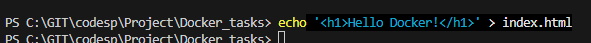
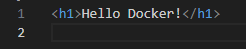
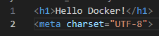
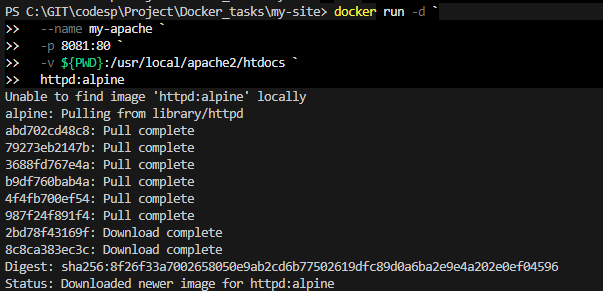
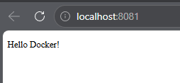

# Статический сайт на Apache
## Apache со стандартной приветственной страницей контейнера
Создайте папку с HTML файлом в папке Docker-проектов
    
    mkdir my-site && cd my-site && touch index.html
---

    echo '<h1>Hello Docker!</h1>' > index.html

## Чтобы в веб-странице поддерживался русский язык, вставьте тэг <meta charset="UTF-8">  

Находясь в папке проекта my-site, выполните загрузку образа, создание контейнера с сервером и его запуск:

для Windows Powershell
    
    docker run -d `
    --name my-apache `
    -p 8081:80 `
     -v ${PWD}:/usr/local/apache2/htdocs `
     httpd:alpine

## Откройте: http://localhost:8081  

#