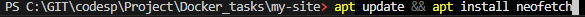

# Ubuntu для тестирования команд
Ubuntu - популярный Linux-дистрибутив.

### Загрузка, запуск и вход во временный Ubuntu контейнер:

    docker run -it --rm ubuntu:latest /bin/bash

### Установите что-нибудь внутри, например:

    apt update && apt install neofetch

---

    curl --version

### Выйти из контейнера можно по команде `exit`