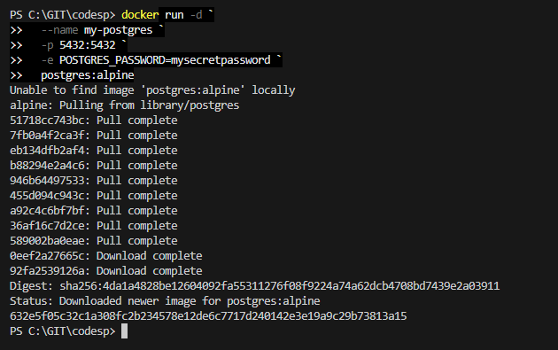
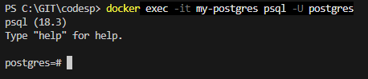
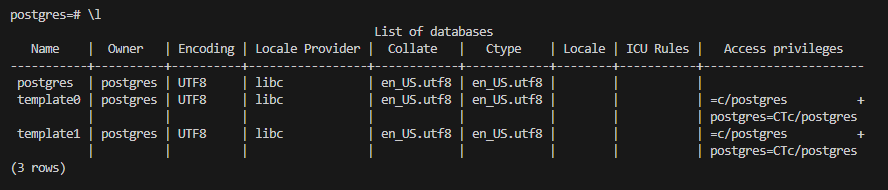
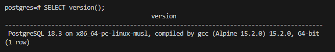
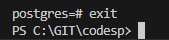

# PostgeSQL
### Запуск PostgreSQL с паролем

в Windows Powershell
    
    docker run -d `
    --name my-postgres `
    -p 5432:5432 `
    -e POSTGRES_PASSWORD=mysecretpassword `
    postgres:alpine  

  

  ### Подключиться через psql
    
    docker exec -it my-postgres psql -U postgres  

### Выполнить несколько демонстрационных команд, например:
Получить список баз данных:

    \l

Получить версию:

    SELECT version();

Выйти из БД:

    exit

