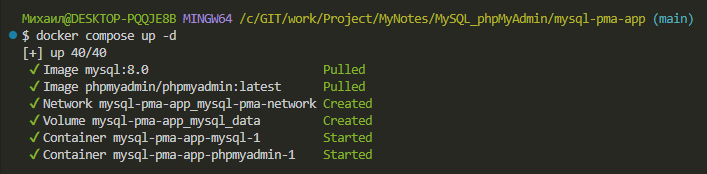
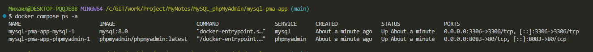
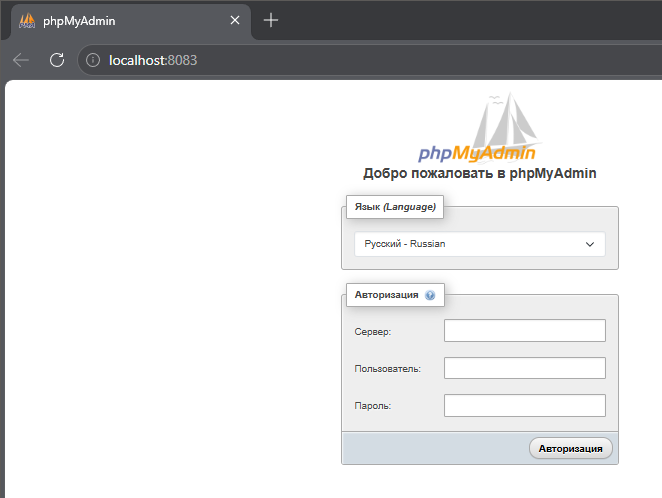
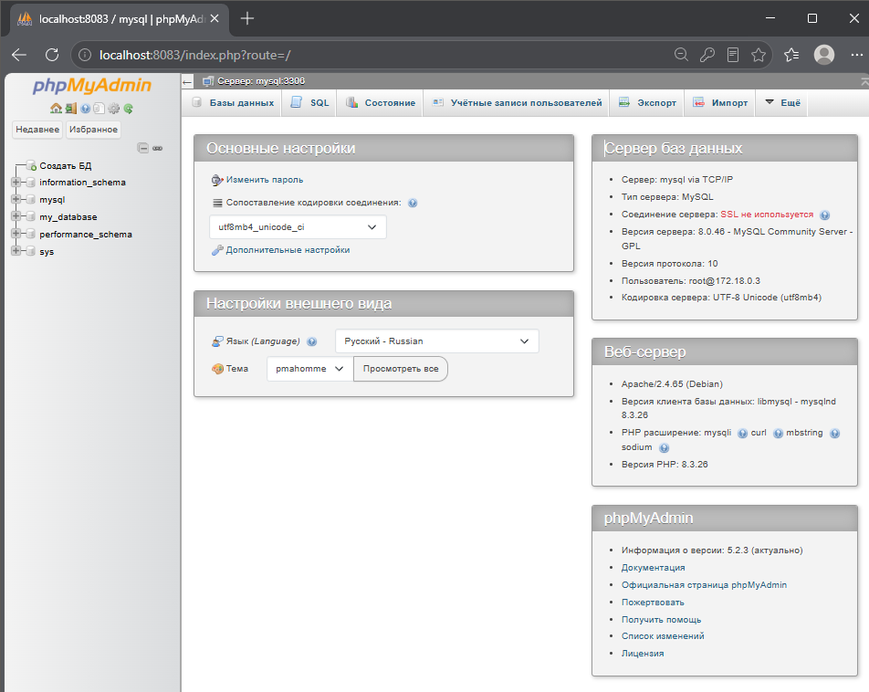
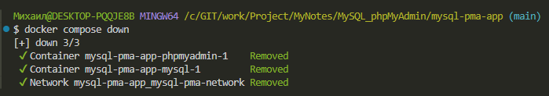
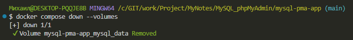
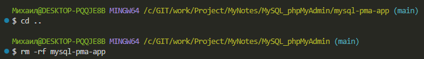

# Docker compose конетейнеры c MySQL + phpMyAdmin
### phpMyAdmin — веб‑приложение с открытым исходным кодом на PHP для администрирования MySQL/MariaDB через браузер. Предоставляет графический интерфейс для управления базами данных без необходимости писать SQL‑команды вручную.

## 1. Создание каталога проекта

        mkdir -p mysql-pma-app && touch mysql-pma-app/compose.yaml && cd mysql-pma-app

### Структура проекта

    mysql-pma-app/
    └──compose.yaml

## 2. Файл настроек композера compose.yml

```
        services:
  # Сервис базы данных MySQL
  mysql:
    # Используем официальный образ MySQL 8.0
    image: mysql:8.0
    # Контейнер будет автоматически перезапускаться, если он остановился или упал
    restart: unless-stopped
    environment:
      # Обязательные переменные окружения для MySQL
      MYSQL_ROOT_PASSWORD: root       # Пароль для root-пользователя
      MYSQL_DATABASE: my_database     # Имя базы данных, которая будет создана автоматически
      MYSQL_USER: my_user             # Имя дополнительного пользователя
      MYSQL_PASSWORD: my_password     # Пароль для дополнительного пользователя
    ports:
      # Пробрасываем порт 3306 хоста на порт 3306 в контейнере
      - "3306:3306"
    volumes:
      # Сохраняем данные базы данных в Docker-томе для персистентности
      - mysql_data:/var/lib/mysql
    networks:
      - mysql-pma-network

  # Сервис phpMyAdmin
  phpmyadmin:
    # Зависит от сервиса mysql, запустится после его готовности
    depends_on:
      - mysql
    # Используем официальный образ phpMyAdmin
    image: phpmyadmin/phpmyadmin:latest
    # Пробрасываем порт 8083 на хосте на порт 80 в контейнере
    ports:
      - "8083:80"
    restart: unless-stopped
    environment:
      # Переменные для подключения к серверу базы данных
      PMA_HOST: mysql        # Имя хоста MySQL-сервера (совпадает с именем сервиса)
      PMA_PORT: 3306         # Порт MySQL-сервера
      PMA_ARBITRARY: 1       # Разрешает подключаться к произвольному серверу, не только к mysql (полезно для отладки)
      UPLOAD_LIMIT: 300M     # Увеличивает лимит на загрузку файлов (для больших SQL-дампов)
    networks:
      - mysql-pma-network

# Определяем общую сеть для связи контейнеров
networks:
  mysql-pma-network:

# Определяем Docker-том для хранения данных базы данных
volumes:
  mysql_data:
 ```       

## 3. Установка и запуск проекта

        docker compose up -d



        docker compose ps -a



## 4. Доступ к локальному сервису phpMyAdmin
- phpMyAdmin: URL: http://localhost:8083
- Сервер: mysql (или localhost:3306)
- Пользователь: root
- Пароль: root





## 5. Управление и полезные команды
### Находясь в папке mysql-pma-app

1. Просмотр логов приложения phpmyadmin в реальном времени
docker compose logs -f phpmyadmin

-f в режиме ожидания (в режиме реального времени)

2. Чтобы выйти из режима просмотра логов, необходимо выполнить Ctrl+C в терминале

Просмотр логов базы данных mysql в реальном времени
        
        docker compose logs -f mysql

Чтобы выйти из режима просмотра логов, необходимо выполнить Ctrl+C в терминале

3. Приостановить запущенный контейнер:
        
        docker compose stop

4. Запустить приостановленный контейнер:
        
        docker compose start

5. Перезапустить
        
        docker compose restart

6. Показать конфигурацию текущего проекта:
        
        docker compose config

7. Вход в контейнер MySQL (имя контейнера можно узнать командой docker compose ps)
        
        docker compose exec mysql bash
## 6. Удаление этого проекта

Находясь в папке mysql-pma-app

1. Остановка контейнеров этого проекта:
        
        docker compose down



2. Остановка с полным удалением всех данных (базы данных и файлов) - опционально:
        
        docker compose down --volumes



или для краткости:

        
        docker compose down -v

3. Выходим из каталога проекта

        cd ..

4. и удаляем

        rm -rf mysql-pma-app


