# Docker compose конетейнеры c PostgreSQL+pgAdmin
- pgAdmin — официальный графический инструмент для администрирования PostgreSQL
- PostgreSQL (часто — Postgres) — свободная объектно‑реляционная система управления базами данных (ORDBMS) с открытым исходным кодом.

### Перед началом работы над этим проектом, проверье другие запущенные у вас docker-compose приложения:
        docker compose ls

## 1. Создание каталога проекта
Структура проекта
```
postgres-pgadmin-app/
└──compose.yaml
```

### Создать структуру проекта можно одной bash-командой:

        mkdir -p postgres-pgadmin-app && cd postgres-pgadmin-app && touch compose.yaml

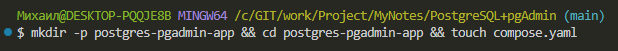

## 2. Содержимое файла конфигурации compose.yaml (или docker-compose.yml для совместимости со старыми версиями Docker Compose)
```
services:
  postgres:
    image: postgres:17-alpine
    container_name: postgres-db
    environment:
      POSTGRES_USER: myuser
      POSTGRES_PASSWORD: mypassword
      POSTGRES_DB: mydatabase
    ports:
      - "5432:5432"
    volumes:
      - postgres_data:/var/lib/postgresql/data

  pgadmin:
    image: dpage/pgadmin4:latest
    container_name: pgadmin-web
    environment:
      PGADMIN_DEFAULT_EMAIL: admin@example.com
      PGADMIN_DEFAULT_PASSWORD: admin
    ports:
      - "5050:80"

volumes:
  postgres_data:
```
## 3. Установка и запуск проекта
### В терминале, находясь в папке с файлом compose.yaml, выполните команду для запуска всех сервисов в фоновом режиме:

                docker compose up -d

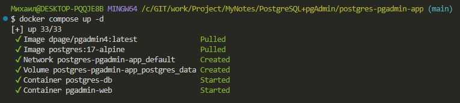

### Дождитесь полной загрузки. Убедиться, что всё работает, можно командой:

                docker compose ps -a

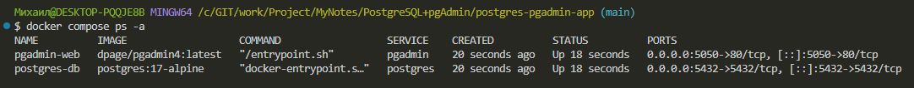

### Оба контейнера (pgadmin и postgres) должны иметь статус Up.

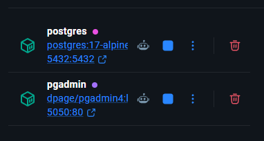

## 4. Доступ к pgAdmin
Откройте в браузере адрес: http://localhost:5050

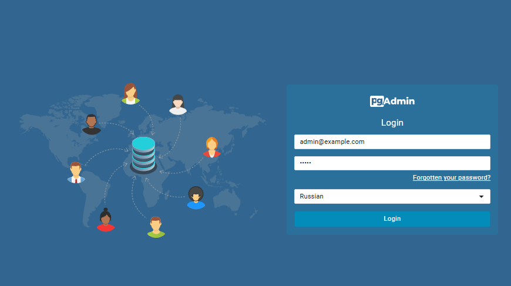

На странице входа используйте данные, указанные в переменных окружения:

- Email/Username: admin@example.com
- Password: admin

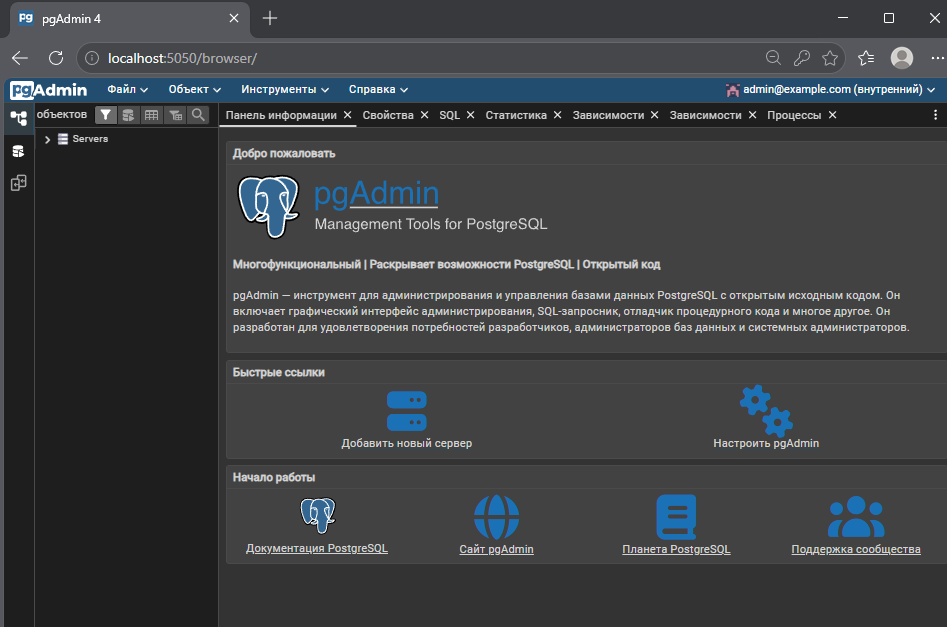

## 5. Подключение pgAdmin к PostgreSQL
На вкладке General задайте любое понятное имя для сервера (например, My Local PostgreSQL).
На вкладке Connection заполните следующие поля:
Host name/address: postgres-db (имя сервиса PostgreSQL из файла compose.yaml).
Port: 5432
Maintenance database: mydatabase
** Username:** myuser
Password: mypassword
Нажмите Save.

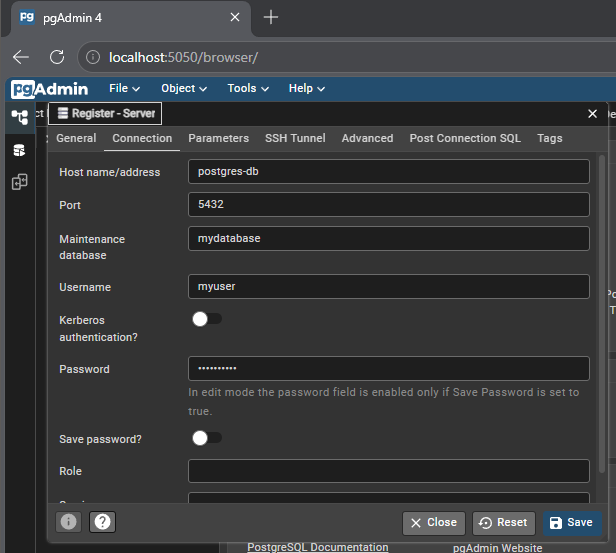

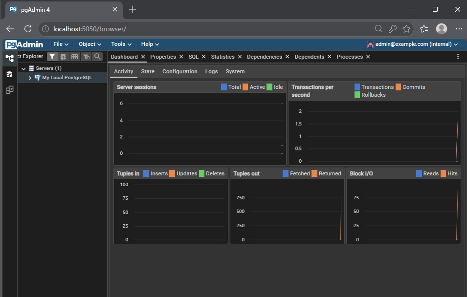

## 6. Удаление проекта 

### Находясь в папке postgres-pgadmin-app

1. Остановка контейнеров этого проекта:
                
                docker compose down

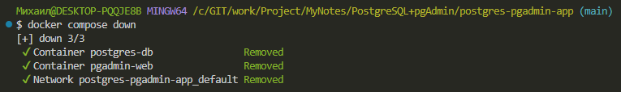

2. Остановка с полным удалением всех данных (базы данных и файлов) - опционально:
                
                docker compose down --volumes

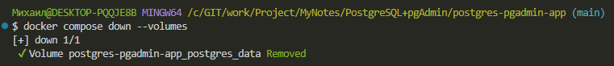

или для краткости:

                docker compose down -v

### Выходим из каталога проекта

                cd ..

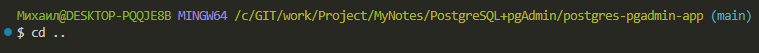

### и удаляем

                rm -rf postgres-pgadmin-app

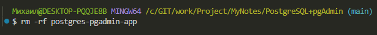