# Docker compose конетейнеры с PostgresSQL

### PostgreSQL (часто — Postgres) — свободная объектно‑реляционная система управления базами данных (ORDBMS) с открытым исходным кодом.

Перед началом работы над этим проектом, проверье другие запущенные у вас docker-compose приложения:

        docker compose ls

их лучше остановить, чтобы снизить риск возникновения конфликтов использования портов!

## 1. Структура проекта
```
postgres-docker-project/
├── data/           # Для хранения данных БД (volume)
├── scripts/        # SQL скрипты для инициализации
├── backups/        # Для бэкапов БД
└── docker-compose.yml  # Главный конфиг
```

В каталоге для Docker-проектов создать одной bash-командой всю структуру для нового приложения:
```
        mkdir -p postgres-docker-project/{data,scripts,backups} && \
touch postgres-docker-project/docker-compose.yml postgres-docker-project/scripts/init.sql && \
cd postgres-docker-project
```
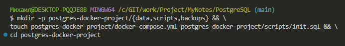

1. Файл docker-compose.yml
```
# Определение секции services - здесь перечисляются все контейнеры/сервисы
services:
  # Объявление сервиса с именем 'postgres'
  # Это логическое имя для обращения внутри docker-compose
  postgres:
    # Используемый Docker образ: postgres версии 15
    # Docker скачает его автоматически если нет локально
    image: postgres:15
    # Имя контейнера в Docker (будет видно в 'docker ps')
    # Без этого Docker сгенерирует случайное имя
    container_name: my-postgres
    # Переменные окружения для настройки PostgreSQL
    # Передаются в контейнер при запуске
    environment:
      # Создает базу данных с именем 'mydatabase' при первом запуске
      POSTGRES_DB: mydatabase
      # Создает пользователя 'myuser' с правами суперпользователя
      POSTGRES_USER: myuser
      # Устанавливает пароль 'mypassword' для пользователя myuser
      POSTGRES_PASSWORD: mypassword
    # Проброс портов между хостом и контейнером
    # Формат: "порт_хоста:порт_контейнера"
    ports:
      # Порт 5432 на хосте → порт 5432 в контейнере
      # Теперь можно подключиться к БД с хоста: localhost:5432
      - "5432:5432"
    # Монтирование томов (файлов/папок) между хостом и контейнером
    volumes:
      # Монтирует папку ./data на хосте в /var/lib/postgresql/data в контейнере
      # Это обеспечивает сохранность данных БД при перезапуске контейнера
      - ./data:/var/lib/postgresql/data
      # Монтирует SQL скрипт в специальную папку инициализации
      # PostgreSQL выполнит этот скрипт при первом запуске БД
      - ./scripts/init.sql:/docker-entrypoint-initdb.d/init.sql
      # Монтирует папку для бэкапов - удобно для экспорта/импорта данных
      - ./backups:/backups
    # Политика перезапуска контейнера при сбоях
    restart: unless-stopped
    # unless-stopped = перезапускать всегда, кроме случаев
    # когда контейнер был остановлен вручную (docker stop)
    # Настройка healthcheck - проверки здоровья контейнера
    # Docker будет автоматически проверять жив ли сервис
    healthcheck:
      # Команда для проверки: пробуем подключиться к PostgreSQL
      # pg_isready - утилита для проверки готовности PostgreSQL
      test: ["CMD-SHELL", "pg_isready -U myuser -d mydatabase"]
      # Интервал между проверками: 30 секунд
      interval: 30s
      # Таймаут ожидания ответа: 10 секунд
      timeout: 10s
      # Количество повторных попыток перед пометкой 'unhealthy'
      retries: 3
```

2. файл: scripts/init.sql
```
-- Создаем дополнительную базу данных
CREATE DATABASE app_db;

-- Создаем дополнительного пользователя
CREATE USER app_user WITH PASSWORD 'app_password';

-- Даем права
GRANT ALL PRIVILEGES ON DATABASE app_db TO app_user;

-- Создаем тестовую таблицу
\c mydatabase;

CREATE TABLE IF NOT EXISTS users (
    id SERIAL PRIMARY KEY,
    name VARCHAR(100) NOT NULL,
    email VARCHAR(100) UNIQUE NOT NULL,
    created_at TIMESTAMP DEFAULT CURRENT_TIMESTAMP
);

-- Вставляем тестовые данные
INSERT INTO users (name, email) VALUES
('Иван Иванов', 'ivan@example.com'),
('Мария Петрова', 'maria@example.com')
ON CONFLICT (email) DO NOTHING;
```

3. Запуск и управление PostgreSQL в Docker

### Находясь в каталоге проекта, выполните:
        
        docker compose up -d

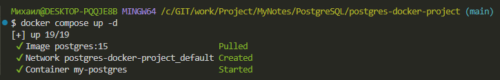

### проверяем его состояние (показать, что запущено именно этим compose-проектом):

        docker compose ps

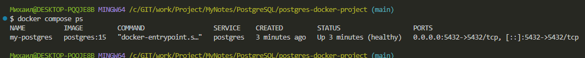

### прочитаем логи запущенного контейнера с PostgreSQL

        docker compose logs postgres

### остановим контейнер с PostgreSQL (ОСТАНОВКА + УДАЛЕНИЕ контейнеров)

docker compose down

## 3. Управление БД в Docker-контейнере

### Подключение к БД:

        docker exec -it my-postgres psql -U myuser -d mydatabase

### чтобы выйти из подключенной БД, надо в командной строке БД выполнить 
        
        EXIT

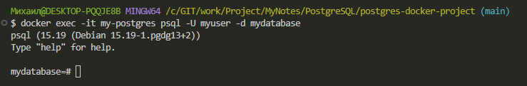
---

        localhost:5432

“Соединение с сайтом localhost было успешно установлено, но он не отправил ничего в ответ.”

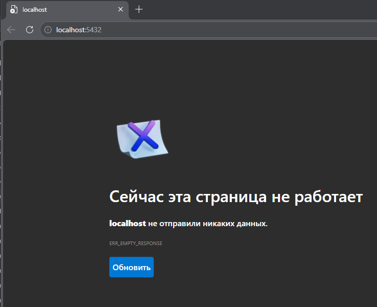

### Останавливаем на время

        docker compose stop

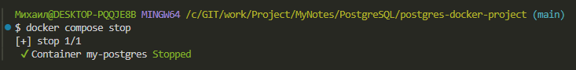

### Запускаем обратно

        docker compose start

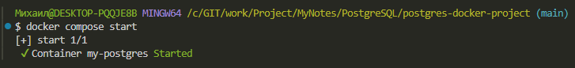

### или

        docker compose up -d

### 4. Удалить установленный Контейнер с PostgresSQL

### Переходим в папку с проектом

        cd ~/Docker/postgres-docker-project

### Останавливаем и удаляем контейнеры, сети

        docker compose down

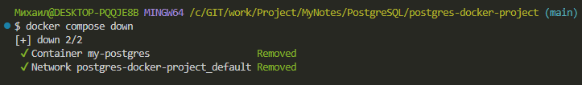

### Или с удалением volumes (данных БД)

        docker compose down -v

### Важно! ключ -v удаляет БД (все данные будут потеряны)!
Важно! При удалении контейнера образ сохраняется!
### Проверяем что контейнеров нет

docker ps -a

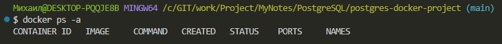

### Проверяем что volumes удалены

        docker volume ls

### Проверяем что нет сетей удаляемого образа

        docker network ls

### Удалить образ PostgreSQL

        docker rmi postgres:15

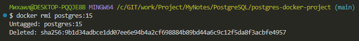

### Или удалить все неиспользуемые образы

        docker image prune -a

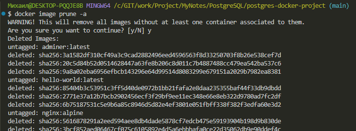

### Проверить результат удаления всех образов

        docker images

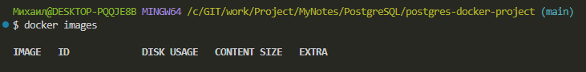

### Теперь можно запустить проект снова, с “чистого листа”!

### Загрузить и установить новый образ PostgreSQL из папки postgres-docker-project docker compose up -d