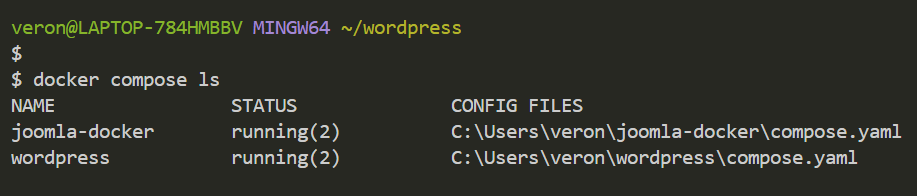
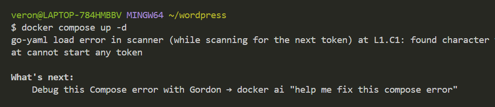
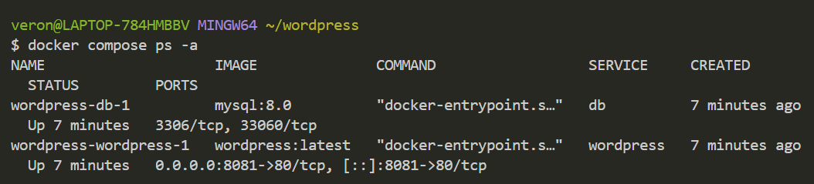
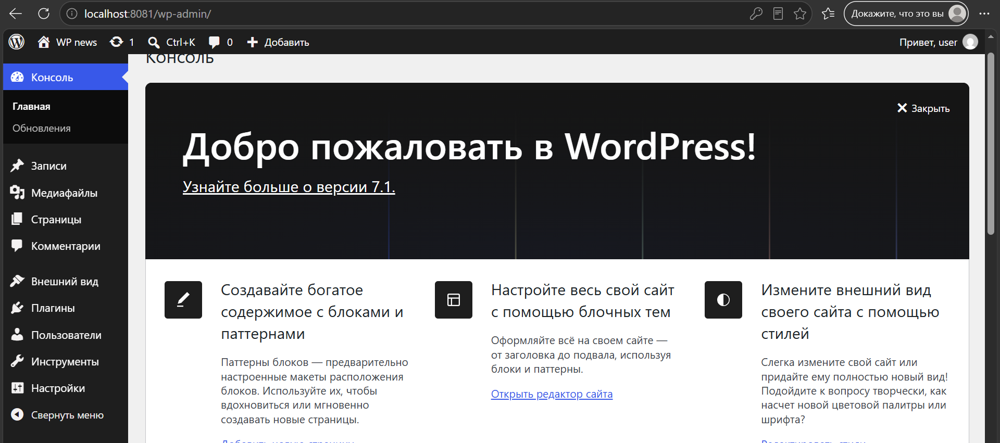
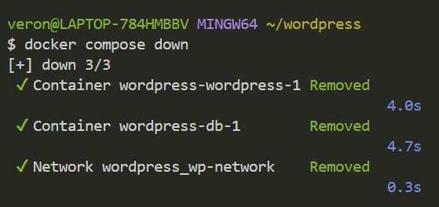
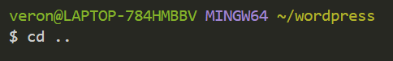
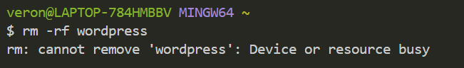

# Docker compose проект c WordPress
## 🛠 Технологии

- **CMS:** WordPress 6.x
- **PHP:** 8.1+
- **База данных:** MySQL 8.0 / MariaDB 10.6+
- **Веб-сервер:** Nginx / Apache
- **Сборка темы:** Node.js, npm, Webpack (если используется)
- **Контроль версий:** Git

## 1. Создание каталога проекта
Перед началом работы над этим проектом, проверье другие запущенные у вас docker-compose приложения:

        docker compose ls

## 2. Структура проекта
        
        wordpress/
        └──compose.yaml

### Структуру проекта можно сделать одной bash-командой, которая автоматически создаст все файлы и каталоги проекта:

        mkdir -p wordpress && touch wordpress/compose.yaml && cd wordpress

## 3. Установка и запуск проекта

        docker compose up -d

### Дождитесь полной загрузки. Убедиться, что всё работает, можно командой:

        docker compose ps -a

## 4. Запустить установку WP-приложения в браузере

Откройте в браузере адрес: http://localhost:8081

- Укажите системe WP логин, например user, и сохраните предложенный пароль. Выполните установку WP и войдите в админ-панель. Из админ-панели откройте сайт.

- Зарегестрируйтесь, а позже войдите

## 5. Успешный вход

## 6. Удаление проекта

Находясь в папке wordpress

1. Остановка контейнеров этого проекта:

        docker compose down

2. Остановка с полным удалением всех данных (базы данных и файлов) - опционально:

        docker compose down --volumes

3. Выход из каталога проекта
        cd ..

4. Удаление

        rm -rf wordpress

    