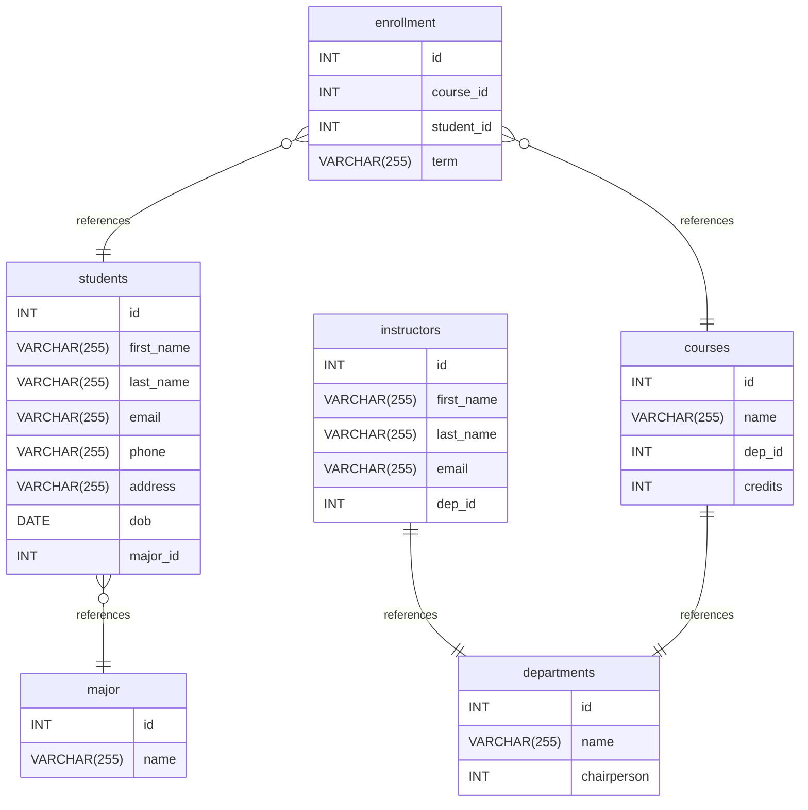

# University schema documentation
## Summary

- [Introduction](#introduction)
- [Database Type](#database-type)
- [Table Structure](#table-structure)
	- [students](#students)
	- [courses](#courses)
	- [enrollment](#enrollment)
	- [instructors](#instructors)
	- [departments](#departments)
	- [major](#major)
- [Relationships](#relationships)
- [Database Diagram](#database-diagram)

## Introduction

## Database type

- **Database system:** Общий
## Table structure

### students

| Name           | Type         | Settings                               | References           | Note |
| -------------- | ------------ | -------------------------------------- | -------------------- | ---- |
| **id**         | INT          | 🔑 PK, not null, unique, autoincrement |                      |      |
| **first_name** | VARCHAR(255) | null                                   |                      |      |
| **last_name**  | VARCHAR(255) | null                                   |                      |      |
| **email**      | VARCHAR(255) | null                                   |                      |      |
| **phone**      | VARCHAR(255) | null                                   |                      |      |
| **address**    | VARCHAR(255) | null                                   |                      |      |
| **dob**        | DATE         | null                                   |                      |      |
| **major_id**   | INT          | null                                   | students_major_id_fk |      | 

### courses

| Name        | Type         | Settings                               | References        | Note |
| ----------- | ------------ | -------------------------------------- | ----------------- | ---- |
| **id**      | INT          | 🔑 PK, not null, unique, autoincrement |                   |      |
| **name**    | VARCHAR(255) | null                                   |                   |      |
| **dep_id**  | INT          | null                                   | courses_dep_id_fk |      |
| **credits** | INT          | null                                   |                   |      | 

### enrollment

| Name           | Type         | Settings                               | References               | Note |
| -------------- | ------------ | -------------------------------------- | ------------------------ | ---- |
| **id**         | INT          | 🔑 PK, not null, unique, autoincrement |                          |      |
| **course_id**  | INT          | null                                   | enrollment_course_id_fk  |      |
| **student_id** | INT          | null                                   | enrollment_student_id_fk |      |
| **term**       | VARCHAR(255) | null                                   |                          |      | 

### instructors

| Name           | Type         | Settings                               | References            | Note |
| -------------- | ------------ | -------------------------------------- | --------------------- | ---- |
| **id**         | INT          | 🔑 PK, not null, unique, autoincrement |                       |      |
| **first_name** | VARCHAR(255) | null                                   |                       |      |
| **last_name**  | VARCHAR(255) | null                                   |                       |      |
| **email**      | VARCHAR(255) | null                                   |                       |      |
| **dep_id**     | INT          | null                                   | instructors_dep_id_fk |      | 

### departments

| Name            | Type         | Settings                               | References | Note |
| --------------- | ------------ | -------------------------------------- | ---------- | ---- |
| **id**          | INT          | 🔑 PK, not null, unique, autoincrement |            |      |
| **name**        | VARCHAR(255) | null                                   |            |      |
| **chairperson** | INT          | null                                   |            |      | 

### major

| Name     | Type         | Settings                               | References | Note |
| -------- | ------------ | -------------------------------------- | ---------- | ---- |
| **id**   | INT          | 🔑 PK, not null, unique, autoincrement |            |      |
| **name** | VARCHAR(255) | null                                   |            |      | 

## Relationships

- **enrollment to students**: many_to_one
- **enrollment to courses**: many_to_one
- **instructors to departments**: one_to_one
- **courses to departments**: one_to_one
- **students to major**: many_to_one

## Database Diagram

