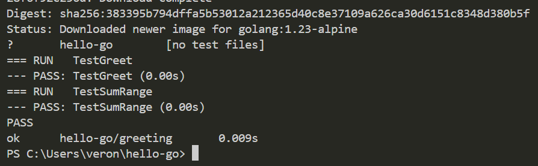
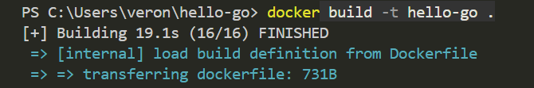
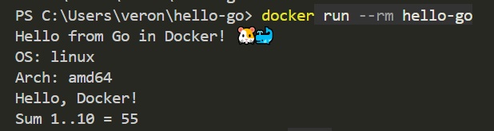
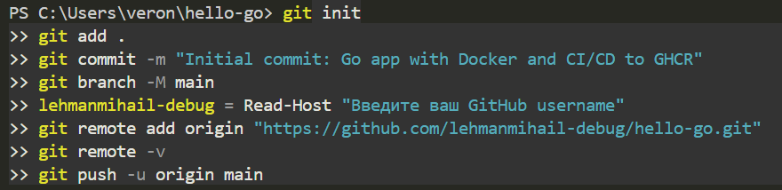
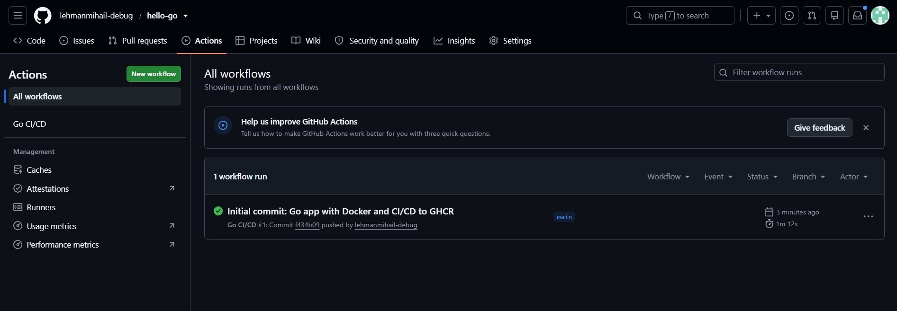
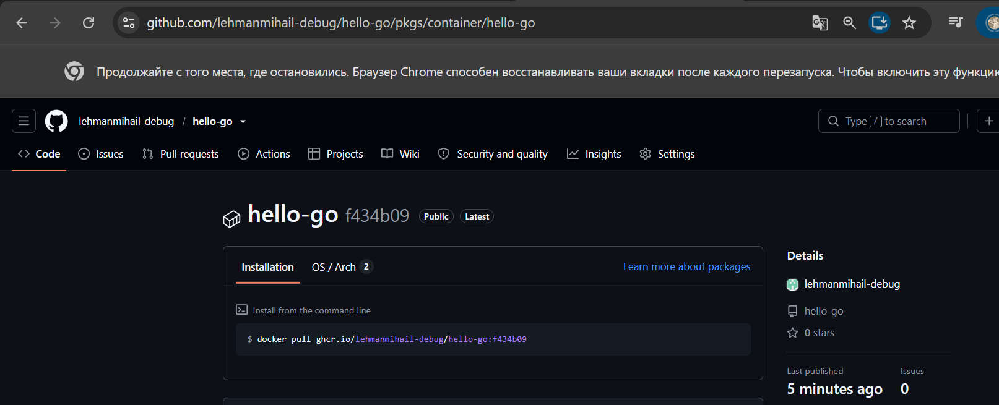
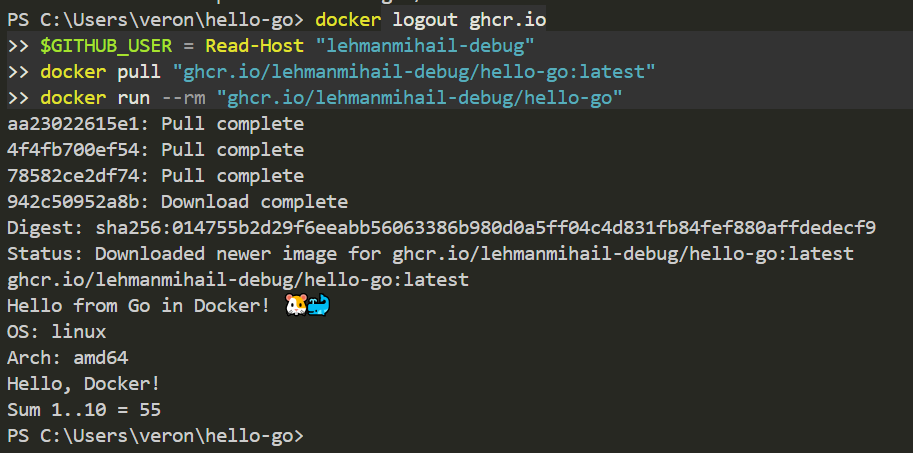

## CI/CD на Go с публикацией в GHCR

Что узнаете/вспомните:
- `go` — `go.mod`, команды `build`, `test`, `vet`
- `gofmt` — проверка форматирования (в CI — `gofmt -l`)
- Встроенные тесты — _test.go, func TestXxx(t *testing.T)
- `Go` компилируется в один статический бинарник — JVM/интерпретатор не нужен
- `Multi-stage Docker` — сборка в golang:alpine, запуск в alpine
- `GitHub Actions` — Go toolchain, кэш модулей, `docker build`
- `GHCR` — публикация образа через `GITHUB_TOKEN`

### 1. Создайте на вашем компьютере, в корневом каталоге текущего пользователя такую структуру:

### 2. Сборка проекта и тесты в Docker (Go на хосте не нужен)

### 3. Запуск контейнера

### 4. Создание пустого репозитория на GitHub

Создайте пустой репозиторий `hello-go` на **GitHub**.

### 5. Запушить проект

### 6. Проверка публикации в GHCR

### 7. Проверка локально

