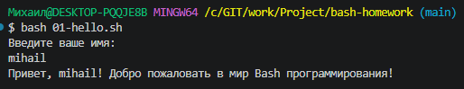
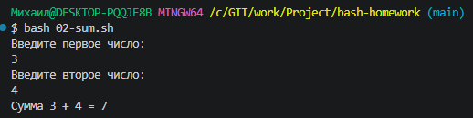
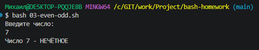
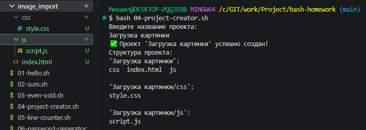
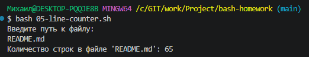
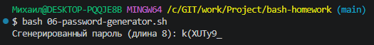
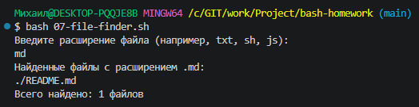
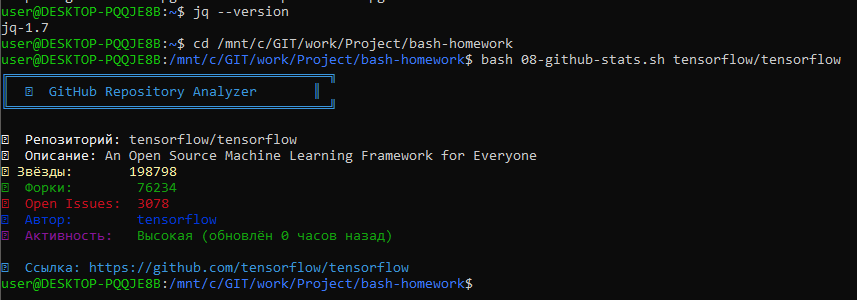

# Самостоятельная работа по Bash программированию

##  Описание
Репозиторий содержит решение самостоятельной работы по Bash программированию. Все скрипты разработаны для выполнения в Git-Bash или WSL Ubuntu.

##  Структура репозитория

bash-homework/
├── README.md
├── 01-hello.sh # Приветствие пользователя
├── 02-sum.sh # Калькулятор суммы
├── 03-even-odd.sh # Проверка четности
├── 04-project-creator.sh # Создание структуры проекта
├── 05-line-counter.sh # Счетчик строк в файле
├── 06-password-generator.sh # Генератор паролей
├── 07-file-finder.sh # Поиск файлов по расширению
└── 08-github-stats.sh # Анализатор GitHub репозиториев

# 🚀 Запуск скриптов

## Все скрипты запускаются командой:
bash
        
        sh script_name.sh

## Примеры запуска:
## 1. Приветствие

        
    bash sh 01-hello.sh
#
## 2. Калькулятор суммы

        
    bash sh 02-sum.sh
#
## 3. Проверка четности

        
    bash 03-even-odd.sh
#
## 4. Создание структуры проекта

        
    bash 04-project-creator.sh
#
## 5. Счетчик строк в файле

        
    bash 05-line-counter.sh
#
## 6. Генератор паролей

        
    bash 06-password-generator.sh
### или с указанием длины
        
    bash 06-password-generator.sh 12
#
## 7. Поиск файлов по расширению

        
    bash 07-file-finder.sh
#
## 8. Анализатор GitHub репозиториев

        
    bash 08-github-stats.sh tensorflow/tensorflow

---
    bash 08-github-stats.sh microsoft/vscode

---  
    bash 08-github-stats.sh nodejs/node