# Самостоятельная работа по командной строке Bash
### 1. Создание простой структуры блога

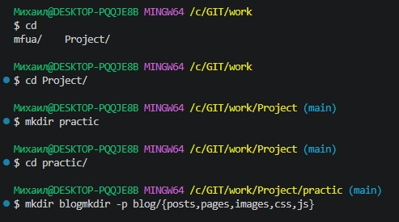

        mkdir -p blog/{posts,pages,images,css,js}
        
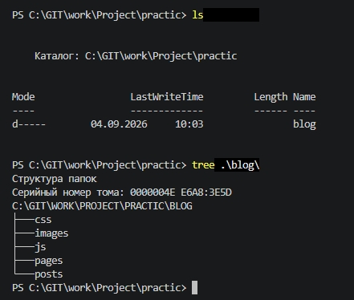

### 2. Двухуровневая структура интернет-магазина

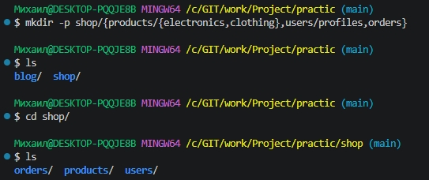

        mkdir -p shop/{products/{electronics,clothing},users/profiles,orders}

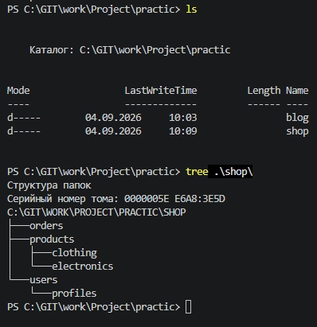

### 3. Структура веб-проекта с файлами

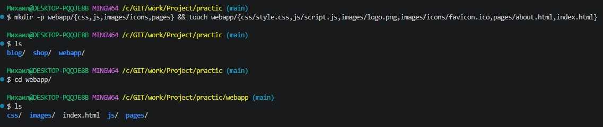

        mkdir -p webapp/{css,js,images/icons,pages} && touch webapp/{css/style.css,js/script.js,images/logo.png,images/icons/favicon.ico,pages/about.html,index.html}

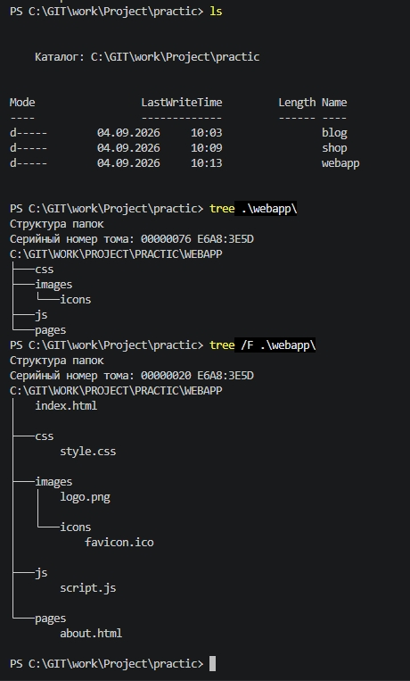

### 4. Проект с шаблонами и конфигами

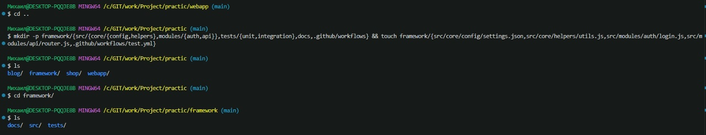

        mkdir -p framework/{src/{core/{config,helpers},modules/{auth,api}},tests/{unit,integration},docs,.github/workflows} && touch framework/{src/core/config/settings.json,src/core/helpers/utils.js,src/modules/auth/login.js,src/modules/api/router.js,.github/workflows/test.yml}

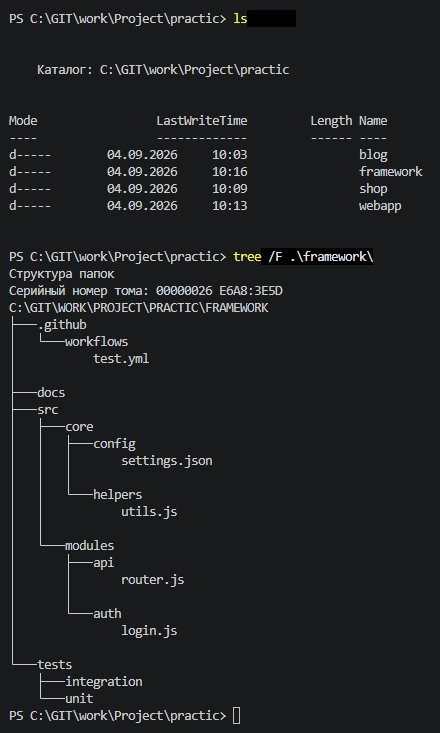

### 5. Генерация структуры по описанию

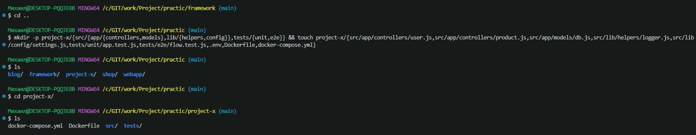

        mkdir -p project-x/{src/{app/{controllers,models},lib/{helpers,config}},tests/{unit,e2e}} && touch project-x/{src/app/controllers/user.js,src/app/controllers/product.js,src/app/models/db.js,src/lib/helpers/logger.js,src/lib/config/settings.js,tests/unit/app.test.js,tests/e2e/flow.test.js,.env,Dockerfile,docker-compose.yml}

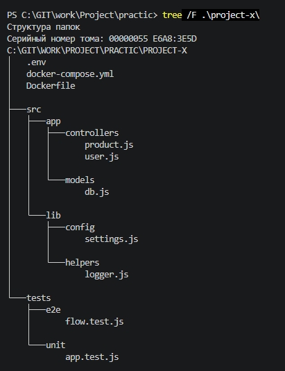

Команда для просмотра дерева (Tree) с всеми ветками и листьями в PowerShell

        tree /F .\dir\
        
#
### 6. Команды из примеров

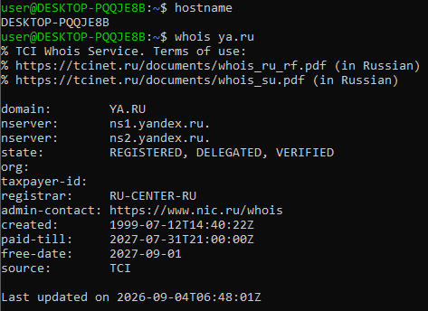

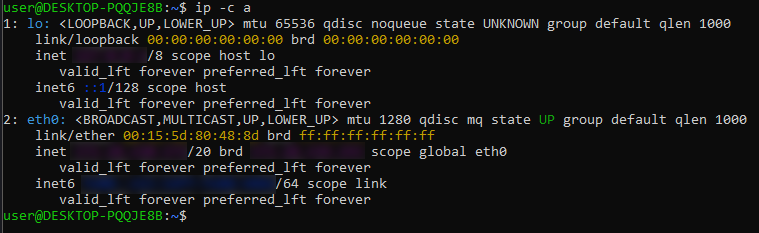

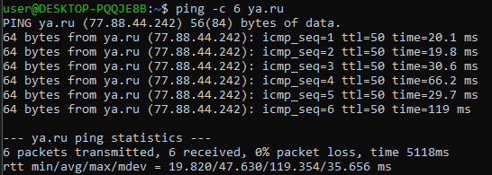

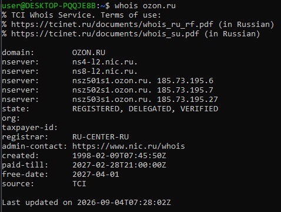

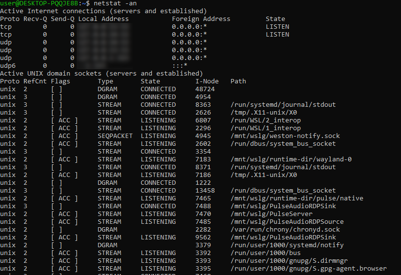

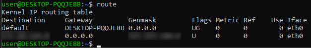